# TP Spring Boot – Gestion des Produits

## Objectif

Ce projet a été réalisé dans le cadre d'un TP pour mettre en pratique les concepts suivants :

- Spring Boot
- Spring Data JPA
- Hibernate
- Spring MVC
- Thymeleaf
- Spring Security

L'objectif est de développer une application web permettant de gérer des produits.

---

## Architecture JPA / Hibernate

Le schéma suivant montre comment **JPA et Hibernate permettent la communication entre l'application et la base de données.**

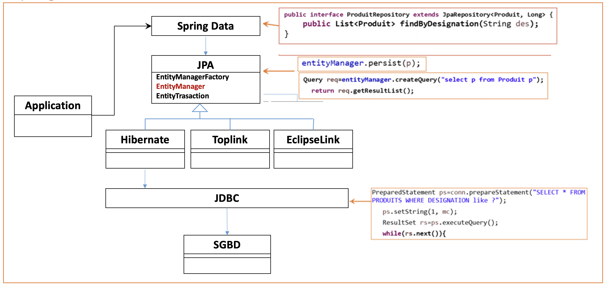

---

## Architecture Spring MVC

Le schéma suivant illustre le fonctionnement du modèle **Spring MVC** et le flux des requêtes HTTP entre le navigateur, le contrôleur et la vue.

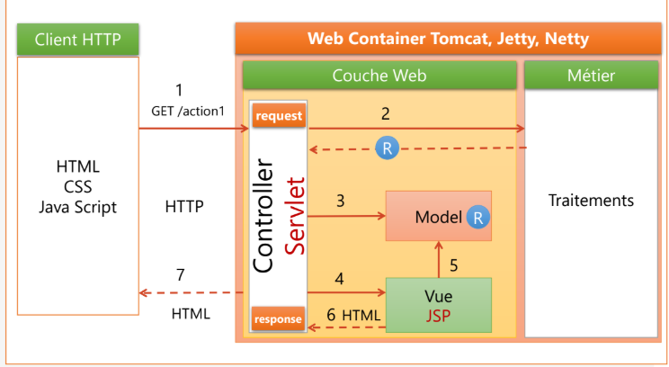

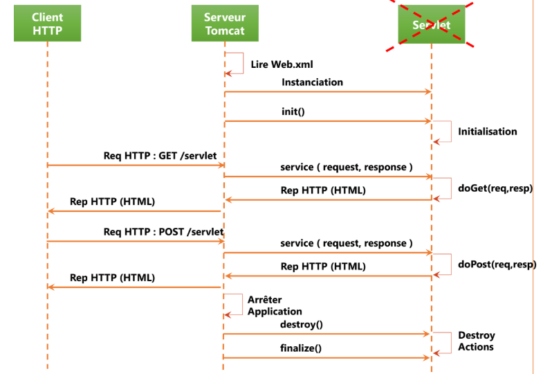

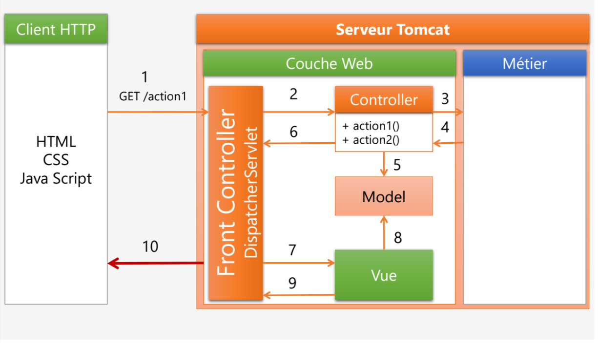

---

# Technologies utilisées

- Java
- Spring Boot
- Spring MVC
- Spring Data JPA
- Hibernate
- Thymeleaf
- Spring Security
- MySQL
- H2 Database
- Bootstrap

---

# Étapes de réalisation

## Question 1 : Création du projet Spring Boot

La première étape consiste à créer un projet **Spring Boot** en utilisant l'outil **Spring Initializr** avec les dépendances suivantes :

- Spring Web
- Spring Data JPA
- H2 Database
- MySQL Driver
- Thymeleaf
- Lombok
- Spring Security
- Spring Validation
### Configuration de l'application

Le fichier `application.properties` permet de configurer la connexion à la base de données et les paramètres JPA/Hibernate :
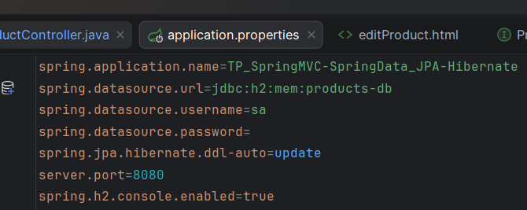


---

## Question 2 : Création de l'entité Product

Dans cette étape, nous avons créé une entité JPA appelée **Product** qui représente un produit dans la base de données.

Cette entité contient les attributs suivants :

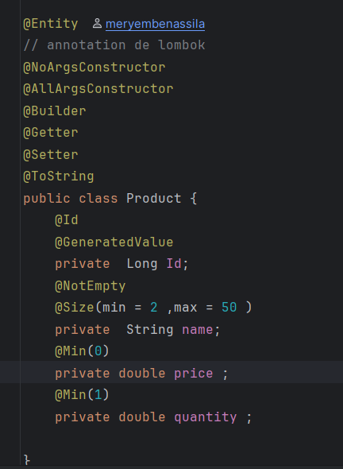

---

### Question 3 : Création de l'interface ProductRepository

Nous avons créé une interface ProductRepository qui étend l'interface JpaRepository afin de permettre l'accès aux données dans la base de données.

Spring Data JPA permet de générer automatiquement les opérations CRUD.

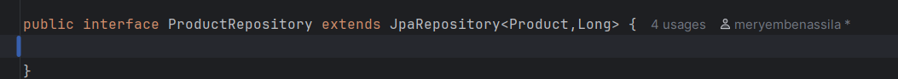

---

### Question 4 : Test de la couche DAO

Pour tester la couche DAO, nous avons utilisé CommandLineRunner afin d'ajouter quelques produits dans la base de données au démarrage de l'application.

Cela permet de vérifier que la communication avec la base de données fonctionne correctement.

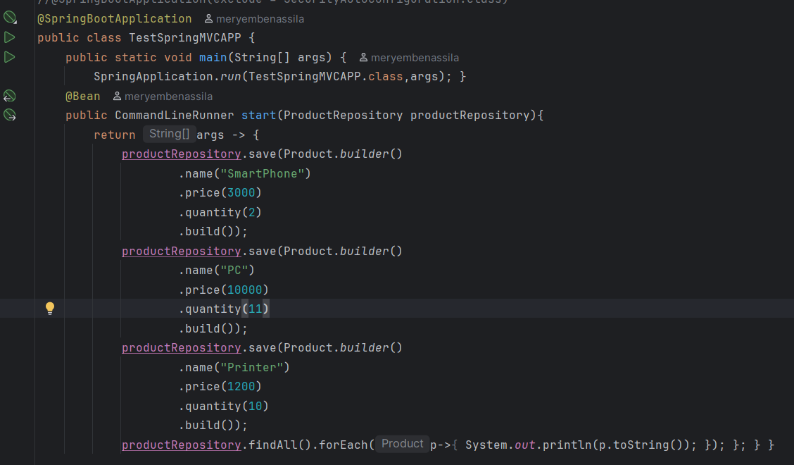

---

### Question 5 : Désactivation temporaire de Spring Security

Afin de faciliter les tests de l'application au début du développement, la protection par défaut de Spring Security a été désactivée temporairement.

Cela permet d'accéder aux pages de l'application sans authentification.
pour la désactiver on a ajouté une condition a l'annotation **@SpringBootApplication** :


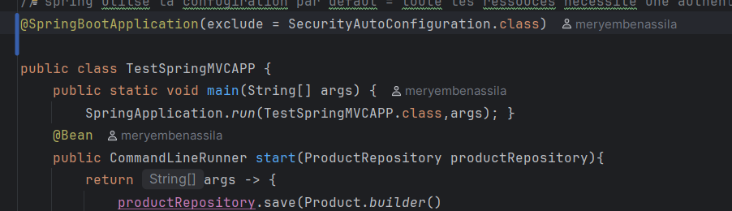

---
### Question 6 : Création du contrôleur et des vues

Dans cette étape, nous avons créé un contrôleur Spring MVC appelé ProductController ainsi que plusieurs pages Thymeleaf.

Les fonctionnalités implémentées sont :

- afficher la liste des produits
- supprimer un produit
- ajouter un produit
- validation du formulaire
- rechercher un produit
- utiliser layout de thymleaf

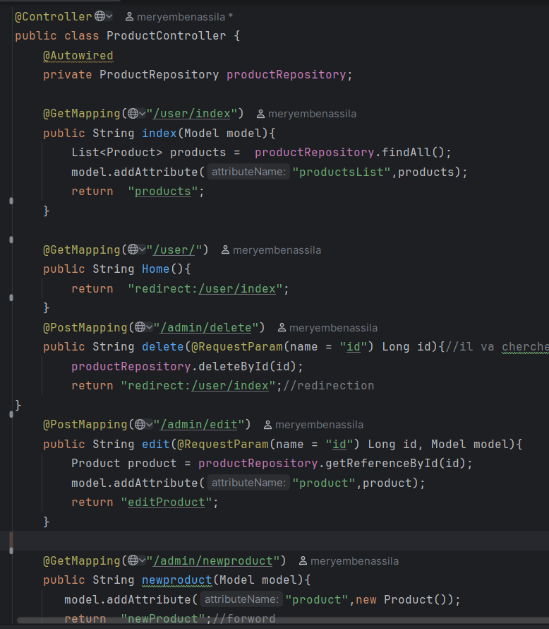

---

### Question 7 : Sécurisation de l'application avec Spring Security

Dans cette étape, nous avons configuré Spring Security afin de sécuriser l'application.

Les fonctionnalités de sécurité implémentées sont :

- authentification des utilisateurs 
- protection des pages 
- gestion des rôles

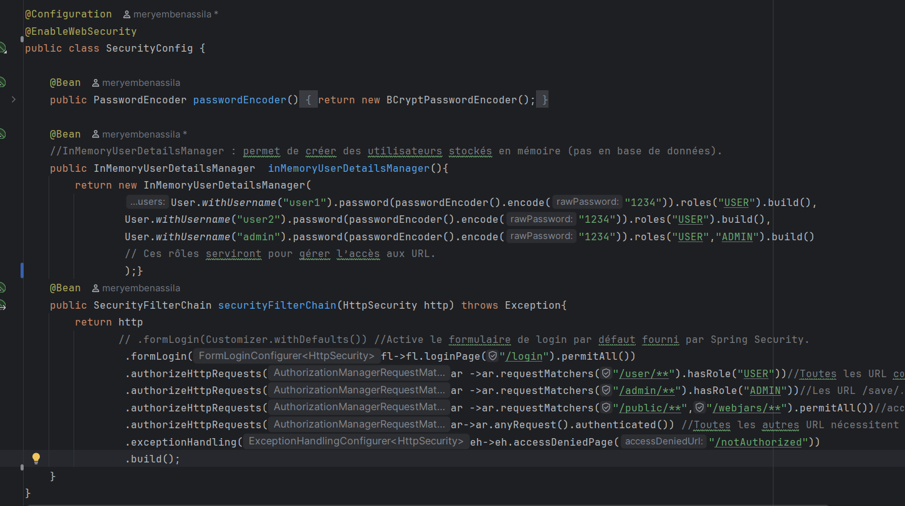

---
### Question 8 : Fonctionnalités supplémentaires

Plusieurs fonctionnalités supplémentaires ont été ajoutées :

- recherche de produits 
- modification d'un produit

## Routes de l'application et permissions

| Route                 | Méthode | Rôle requis     | Description                                |
|-----------------------|---------|----------------|--------------------------------------------|
| /login                | GET     | Tous           | Page de connexion                           |
| /logout               | GET     | Tous           | Déconnexion de l'utilisateur               |
| /user/index           | GET     | USER           | Afficher la liste des produits             |
| /user/                | GET     | USER           | Redirection vers /user/index               |
| /user/search          | GET     | USER           | Recherche de produits                       |
| /user/rénitialiser    | GET     | USER           | Réinitialisation de la recherche            |
| /admin/newproduct     | GET     | ADMIN          | Page pour créer un nouveau produit          |
| /admin/saveProduct    | POST    | ADMIN          | Enregistrer un produit (ajout ou modification) |
| /admin/edit           | POST    | ADMIN          | Page pour modifier un produit existant      |
| /admin/delete         | POST    | ADMIN          | Supprimer un produit                         |
| /notAuthorized        | GET     | Tous           | Page affichée quand l’utilisateur n’est pas autorisé |

## Interface de l'application

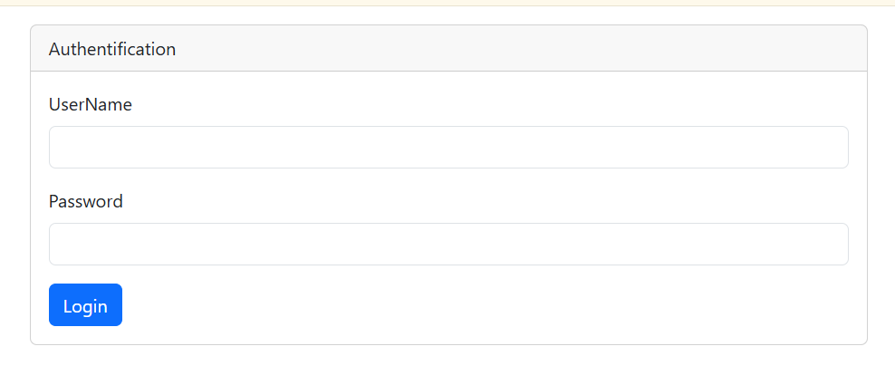
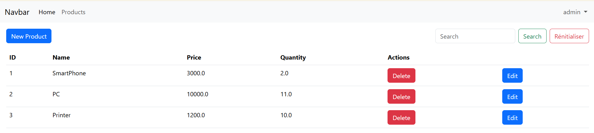
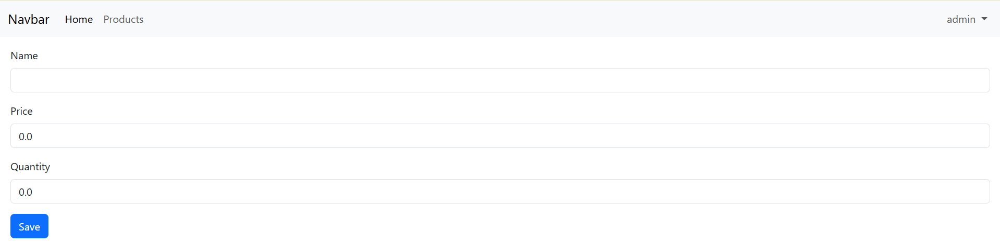

## Lancer le projet

### Cloner le projet
```bash
https://github.com/meryembenassila/TP_SpringMVC-SpringData_JPA-Hibernate.git 
```

### Exécuter l'application

Lancer la classe principale  **TestSpringBootMVCAPP.java** 

Ensuite, ouvrir dans le navigateur :
```bash
http://localhost:8080
```

### Utilisateurs créés pour le login

| Nom d’utilisateur | Mot de passe | Rôle        |
|------------------|-------------|------------|
| user1            | 1234        | USER       |
| user2            | 1234        | USER       |
| admin            | 1234        | USER, ADMIN|